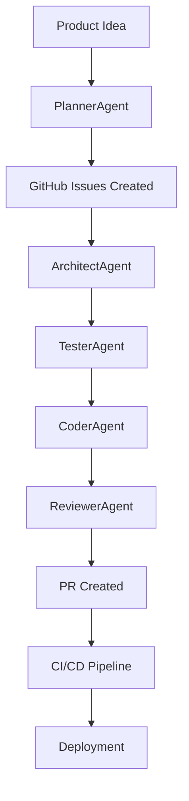

# Gemini Agents Architecture

## Overview
Gemini Agents is a **universal AI-driven project base** that can be cloned and reused for any software project. It automates the entire development lifecycle: planning → coding → testing → reviewing → CI/CD → deployment.

## Reusable Project Concept

**Clone Once, Use Everywhere:**
```bash
git clone <your-gemini-agents-repo> any-new-project
# Instantly get: AI agents, templates, CI/CD, documentation
```

**Universal Foundation:**
- 🤖 5 AI agents for complete development workflow
- 📁 Multi-stack project templates (Node.js, React, Python)
- 🔄 Automated TDD cycle (test → code → review)
- 📋 GitHub integration (repos, issues, PRs)
- ⚙️ CI/CD pipelines ready to deploy
- 📚 Complete documentation suite

## Core Components

### 1. CLI Bootstrap (`cli/bootstrap.js`)
- Interactive project creation
- Tech stack recommendation via Gemini
- GitHub repo and issue creation
- Template scaffolding

### 2. AI Agents (`lib/agents/`)
- **PlannerAgent**: Breaks down ideas into phases and tickets
- **ArchitectAgent**: Designs technical architecture and system diagrams
- **CoderAgent**: Implements code based on failing tests (TDD)
- **TesterAgent**: Writes comprehensive test suites
- **ReviewerAgent**: Performs AI code reviews with checklists

### 3. Orchestrator (`orchestrator.js`)
- Coordinates agent workflows
- Manages git branches and PRs
- Implements TDD cycle: test → code → review
- Integrates with GitHub Issues

### 4. Templates (`cli/templates/`)
- **node-express**: REST API with Express.js
- **nextjs**: Full-stack React application
- **python-flask**: Python web service

## Workflow



## Reusable Project Patterns

### 1. Clone as Universal Base
```bash
# Use for ANY new project
git clone <your-repo> saas-platform
git clone <your-repo> mobile-api  
git clone <your-repo> e-commerce-site
```

### 2. AI Project Bootstrap
```bash
npx ngen
# AI generates: roadmap, GitHub issues, scaffolded code, CI/CD
```

### 3. TDD Feature Development
```bash
node orchestrator.js "Add user authentication"
# Automated: tests → code → review → PR
```

### 4. Individual Agent Usage
```javascript
// Use agents programmatically in any project
import { generateArchitecture } from './lib/agents/architectAgent.js';
const arch = await generateArchitecture("Microservices architecture");
```

### 5. Template Customization
```bash
# Modify templates for your stack
echo "custom config" > cli/templates/nextjs/my-config.js
# All future projects get your customizations
```

## Configuration

All agents use environment variables from `.env`:
- `GEMINI_API_KEY`: For AI model access
- `GITHUB_TOKEN`: For repo/issue management
- `GITHUB_OWNER`: Your GitHub username
- `BIG_MODEL`: Complex tasks (default: gemini-1.5-pro-latest)
- `SMALL_MODEL`: Simple tasks (default: gemini-1.5-flash-latest)